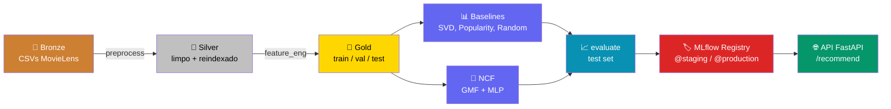

# Recomendador Neural E-commerce


Sistema de recomendação de produtos baseado no comportamento de navegação dos usuários, implementado com **Neural Collaborative Filtering (NCF/NeuMF)** em PyTorch. Pipeline completo containerizado com Docker, dados versionados com DVC e experimentos rastreados no MLflow.

> **Tech Challenge Fase 02 — FIAP Pós-Tech MLET**

## Sumário

- [Arquitetura](#arquitetura)
- [Resultados](#resultados)
- [Stack](#stack)
- [Início Rápido](#início-rápido)
- [API de Recomendação (Serving)](#api-de-recomendação-serving)
- [Estrutura do Projeto](#estrutura-do-projeto)
- [Design Patterns](#design-patterns)
- [Métricas de Avaliação](#métricas-de-avaliação)
- [Dataset](#dataset)
- [Testes](#testes)
- [Deploy na AWS (bônus)](#deploy-na-aws-bônus)
- [Critérios de Avaliação](#critérios-de-avaliação)
- [Etapas de Desenvolvimento](#etapas-de-desenvolvimento)
- [Contribuindo](#contribuindo)

---

## Arquitetura

```
Usuário → Embedding ─┐
                      ├─ GMF (element-wise ×) ──┐
Item    → Embedding ─┘                           ├─ Linear → Score
                                                 │
Usuário → Embedding ─┐                           │
                      ├─ Concat → MLP layers ────┘
Item    → Embedding ─┘
```

O modelo combina **Generalized Matrix Factorization (GMF)** — que captura interações lineares — com um **MLP** que captura não-linearidades, resultando na arquitetura **NeuMF** (He et al., 2017).

### Pipeline de ponta a ponta



5 stages no `dvc.yaml` (`preprocess`, `feature_eng`, `train_baselines`, `train`, `evaluate`) — `dvc dag` mostra o grafo completo, `dvc repro` executa tudo automaticamente respeitando as dependências entre eles.

---

## Resultados

| Modelo | NDCG@10 | Precision@10 | Recall@10 | HR@10 | MAP@10 |
|---|---|---|---|---|---|
| NCF (NeuMF) | 0.0345 | 0.0231 | 0.0445 | 0.1898 | 0.0148 |
| Popularity | **0.0350** | 0.0244 | 0.0396 | 0.1983 | 0.0153 |
| SVD | 0.0079 | 0.0051 | 0.0132 | 0.0509 | 0.0031 |
| Random | 0.0061 | 0.0052 | 0.0064 | 0.0509 | 0.0020 |

O NCF fica marginalmente abaixo do Popularity (dataset pequeno e denso favorece recomendação não-personalizada) — mesmo depois de testar 3 configs de tuning. Histórico completo do tuning, evidência dos runs no MLflow e leitura honesta desse trade-off no [Model Card](docs/model_card.md).

---

## Stack

| Componente | Tecnologia |
|---|---|
| Modelo | PyTorch 2.x — NeuMF (GMF + MLP) |
| Baselines | Scikit-Learn — SVD, Popularity, Random |
| Experimentos | MLflow — tracking + Model Registry |
| Versionamento de dados | DVC — pipeline reprodutível |
| Dependências | Poetry — lock file commitado |
| Containerização | Docker multi-stage + docker-compose |
| Serving | FastAPI + Uvicorn |
| Infra (bônus) | Terraform — API Gateway + ECS Fargate Spot na AWS |
| Qualidade de código | Ruff + pre-commit hooks |
| Configuração | Pydantic Settings + .env |
| Testes | Pytest |

---

## Início Rápido

**Pré-requisitos:** Python 3.11+, [Poetry](https://python-poetry.org/), Docker + Docker Compose, git.

Caminho recomendado — do zero até o modelo registrado:

```bash
git clone https://github.com/lucasbergamo/recomendador_neural_ecommerce.git
cd recomendador_neural_ecommerce

poetry install
cp .env.example .env

make docker-up      # sobe o MLflow em container (localhost:5000)
dvc repro           # pipeline completo: preprocess → feature_eng →
                     # {train_baselines, train} → evaluate

make test           # 29 testes, roda local (rápido, não precisa de container) —
                     # rodar DEPOIS do dvc repro: os testes de API carregam
                     # data/gold/metadata.parquet e models/ncf.pt de verdade
make register       # registra o modelo final no MLflow Model Registry
```

Depois disso, em `http://localhost:5000`:
- aba **Runs** (ou **Evaluation runs**, dependendo da versão da UI) do experimento `recommendation-system` — todos os runs de treino/baseline
- **Models → ncf-recommender** — o modelo registrado, aliases `@staging` e `@production`

> [!NOTE]
> **Remote do DVC**: é local (`~/dvc-storage`, simula um bucket S3) — quem clona o repo não tem acesso a essa pasta, então `dvc pull` **não vai funcionar**. Isso é intencional: `dvc repro` reconstrói tudo do zero a partir dos CSVs brutos do MovieLens já commitados em `data/bronze/`, sem depender de nenhum remote externo.
>
> **Por que não S3 de verdade**: o padrão de mercado em produção é DVC remote em S3 (ou GCS/Azure Blob) **privado**, com acesso via IAM role da equipe/CI — não público. Não usamos aqui porque a conta AWS deste projeto é uma sandbox temporária de Learner Lab (sem colaborador de equipe pra conceder role IAM, sem garantia de vida útil após o curso) — nesse contexto, tornar o bucket público seria a única forma de um avaliador externo acessar, o que foge do padrão profissional e ainda dependeria da conta sandbox continuar existindo. O design atual (CSV bruto commitado + `dvc repro` recalculando) é deliberadamente auto-contido: funciona pra qualquer avaliador, em qualquer lugar, sem depender de credencial ou conta nenhuma.

<details>
<summary>Alternativas — sem Docker, ou passo a passo manual</summary>

**Docker, passo a passo** (equivalente ao `dvc repro`, mas manual — tudo containerizado, sem depender de Poetry local):

```bash
make docker-up
make docker-lint
make docker-data
make docker-train-baselines
make docker-train
make docker-eval
make docker-test    # roda depois dos dados existirem — os testes de API carregam
                     # data/gold/metadata.parquet de verdade, não com dado sintético
make docker-register
make docker-serve   # sobe a API HTTP servindo o modelo — ver seção "API de Recomendação"
```

> [!WARNING]
> **Ordem importa**: `docker-test` inclui os testes de `test_api.py`, que sobem a API de
> verdade e carregam `data/gold/metadata.parquet` — rodar antes de `docker-data`/`docker-train`
> derruba esses 3 testes com `FileNotFoundError` (os outros 26 não dependem disso e passam
> normalmente). `docker-serve` empacota `models/ncf.pt` e `data/gold/metadata.parquet`
> **dentro** da imagem (não via volume, como os outros serviços) — também precisa rodar
> `docker-train` antes, senão o build falha por falta desses arquivos.

> [!WARNING]
> **Recursos mínimos pra buildar**: as imagens incluem PyTorch, então o build é pesado.
> Rode `make check-resources` antes (ou deixe `make docker-build` rodar automaticamente)
> — recomendado 6GB+ de RAM disponíveis pro Docker e 10GB+ de disco livre. Com menos
> que isso, o build pode travar a máquina em vez de só ficar lento.

> [!NOTE]
> **Por que não publicar a imagem pronta num registro (ECR)**: o padrão de mercado em
> produção é registro privado (ECR/Docker Hub) com permissão de pull via IAM role pra
> equipe/CI — não público. Além da mesma limitação da conta sandbox (Learner Lab temporária,
> sem colaborador pra IAM), o critério de avaliação "Docker" espera justamente ver o
> **build a partir do Dockerfile** funcionando — publicar imagem pronta pra pull tiraria
> exatamente a evidência que está sendo avaliada. Por isso o caminho documentado é sempre
> build local, nunca pull de um registro.

**Sem Docker** (MLflow local via Poetry, precisa estar rodando antes dos comandos de treino):

```bash
poetry install && cp .env.example .env
make lint
make mlflow &        # ou outro terminal — acesse http://localhost:5000

make data
make train-baselines
make train
make eval
make test            # DEPOIS de data/train — os testes de API precisam de
                      # data/gold/metadata.parquet e models/ncf.pt reais
make register
```

</details>

---

## API de Recomendação (Serving)

Endpoint HTTP mínimo (FastAPI) que carrega `models/ncf.pt` uma vez na inicialização e
expõe `recommend_top_k` — a mesma inferência usada em `evaluate`/`register`, agora
acessível por fora do processo Python.

**Local:**

```bash
make docker-serve
curl http://localhost:8000/health
curl "http://localhost:8000/recommend/5?k=10"
```

| Rota | Descrição |
|---|---|
| `GET /health` | Liveness check — `{"status": "ok"}` |
| `GET /recommend/{user_id}?k=10` | Top-K itens recomendados, com `item_id` e `title`. `user_id` é o ID **reindexado** (0 a 942), não o ID original do MovieLens. `k` é opcional (default 10). |
| `GET /docs` | Documentação interativa (Swagger UI), gerada automaticamente pelo FastAPI |

`user_id` fora do intervalo `0..942` retorna `404` com mensagem explicando o range válido.

**Na AWS (bônus — URL pública):** ver seção [Deploy na AWS](#deploy-na-aws-bônus) abaixo.

> [!NOTE]
> **Disponibilidade**: em produção, a API roda em capacidade **Spot** (ver seção AWS) —
> mais barata, mas a AWS pode reciclar a instância a qualquer momento. O ECS repõe a
> task automaticamente, mas existe uma janela curta (tipicamente alguns minutos) até
> ela voltar a responder. Se a chamada falhar, **tente novamente em alguns minutos**
> antes de assumir que está fora do ar.

---

## Estrutura do Projeto

```
recomendador_neural_ecommerce/
├── src/
│   ├── data/
│   │   ├── load.py          # Download MovieLens 100K
│   │   ├── preprocess.py    # Bronze → Silver
│   │   ├── features.py      # Silver → Gold (interaction matrix, splits)
│   │   └── pipeline.py      # Orquestrador do pipeline de dados
│   ├── models/
│   │   ├── base.py          # Template Method: BaseRecommender
│   │   ├── ncf.py           # NeuMF — GMF + MLP
│   │   ├── baselines.py     # SVD, Popularity, Random
│   │   └── factory.py       # Factory Pattern: cria modelos por nome
│   ├── training/
│   │   ├── trainer.py       # Loop de treino + early stopping + MLflow
│   │   ├── train_baselines.py
│   │   └── strategies.py    # Strategy Pattern: Adam, AdamW, SGD
│   ├── evaluation/
│   │   └── metrics.py       # NDCG@K, Precision@K, Recall@K, HR@K, MAP@K
│   └── utils/
│       ├── config.py        # Pydantic Settings + paths
│       ├── logger.py        # Structlog
│       └── reproducibility.py
├── tests/                   # Pytest: smoke, unit, integration
├── data/
│   ├── bronze/              # Dados brutos (DVC)
│   ├── silver/              # Dados limpos (DVC)
│   └── gold/                # Features prontas (DVC)
├── docs/
│   ├── model_card.md        # Documentação do modelo
│   ├── dataset.md           # Documentação do dataset
│   └── monitoring_plan.md   # Plano de monitoramento
├── scripts/
│   ├── validate_env.py      # Valida ambiente + cria diretórios
│   └── register_model.py    # Registra o modelo final no MLflow Model Registry
├── Dockerfile               # Multi-stage: builder + runtime + ci (lint/test em container)
├── docker-compose.yml       # MLflow server + data-pipeline + train-baselines + train-model + ci
├── dvc.yaml                 # 5 stages: preprocess → feature_eng → {train_baselines, train} → evaluate
├── pyproject.toml           # Poetry — deps prod/dev separadas
└── Makefile                 # Comandos de desenvolvimento
```

---

## Design Patterns

| Pattern | Onde | Por quê |
|---|---|---|
| **Template Method** | `src/models/base.py` | `BaseRecommender` define `predict()` e `recommend_top_k()` — subclasses só implementam `forward()` |
| **Factory** | `src/models/factory.py` | `RecommenderFactory.create(ModelType.NCF, ...)` — desacopla criação de uso |
| **Strategy** | `src/training/strategies.py` | Troca Adam/AdamW/SGD sem mudar o trainer |

---

## Métricas de Avaliação

Todas as métricas são calculadas no test set com **leave-time-out split** (últimas interações por usuário):

| Métrica | Descrição |
|---|---|
| **NDCG@K** | Ranking quality — penaliza hits em posições piores |
| **Precision@K** | Fração dos K recomendados que são relevantes |
| **Recall@K** | Fração dos relevantes encontrados nos K recomendados |
| **HR@K** (Hit Rate) | 1 se pelo menos 1 item relevante está nos K recomendados |
| **MAP@K** | Mean Average Precision — combina precision e ordem |

---

## Dataset

Documentação completa em [`docs/dataset.md`](docs/dataset.md).

- **MovieLens 100K**: 100.000 ratings brutos (99.287 após filtro de cold-start), 943 usuários, 1.682 itens brutos (1.349 após filtro)
- Download automático via `make data` (ou já commitado em `data/bronze/` — funciona sem internet)
- Alternativas: RetailRocket, Instacart, Amazon Reviews (ver docs/dataset.md)

---

## Testes

```bash
make test        # todos os testes
make test-cov    # com relatório de cobertura
```

Os testes cobrem:
- Smoke tests (imports e inicializações)
- Modelos (forward pass, shapes, ranges)
- Métricas (NDCG, Precision, Recall, HR, MAP)
- Pipeline de dados (preprocessing, feature engineering)

---

## Deploy na AWS (bônus)

A API de recomendação (seção anterior) está publicada com **URL pública real**, atendendo
ao critério de bônus do enunciado ("container acessível via URL pública") — não é só uma
prova pontual de que o container roda, é um serviço vivo.

```
Internet → API Gateway (REST API, HTTPS gerenciado)
              │  exige header x-api-key
              ▼
         VPC Link → Network Load Balancer interno (sem IP público)
                          │
                          ▼
                    ECS Fargate Spot (subnet privada, sem IP público)
                          └─ container FastAPI + modelo NCF embutido
```

- **URL**: `https://5xhc4ww417.execute-api.us-east-1.amazonaws.com/prod`
- **Autenticação**: header `x-api-key` obrigatório (403 sem ele) — a chave de demonstração
  foi compartilhada com o avaliador por canal separado do repositório (vídeo STAR ou nota
  à parte), nunca em texto no código — prática padrão de segurança: segredo não trafega no
  mesmo canal que o código público.
- **Infraestrutura como código**: todo o provisionamento está em [`infra/`](infra/)
  (Terraform) — subnet privada, VPC Endpoints (sem NAT Gateway), NLB interno, ECS Fargate
  Spot com self-healing nativo, API Gateway com Usage Plan (throttle de 5 req/s) e API Key.
  Reproduzível com `terraform init && terraform apply` (requer credenciais AWS válidas).
- **Disponibilidade**: roda em capacidade **Spot** — mais barata, mas a AWS pode reciclar a
  instância a qualquer momento. O ECS repõe a task sozinho; se uma chamada falhar, tente de
  novo em alguns minutos antes de assumir que está fora do ar.
- **Desligar depois de usar**: `cd infra && terraform destroy` remove todos os recursos —
  evita gastar o budget do lab à toa depois da correção.

---

## Critérios de Avaliação

Mapeamento direto do critério do enunciado pra onde a evidência está no projeto:

| Critério | Peso | Onde está a evidência |
|---|---|---|
| Clean code e estrutura | 15% | `src/` modular por responsabilidade, type hints, [Design Patterns](#design-patterns), `make lint` sem erros |
| Reprodutibilidade | 15% | `poetry.lock` commitado, `.env.example`, [Início Rápido](#início-rápido) — instalação limpa documentada |
| Docker | 15% | `Dockerfile` multi-stage (5 estágios: builder, runtime, lint, ci, serve), `docker-compose.yml` |
| DVC + Pipeline | 15% | `dvc.yaml` com 5 stages, `dvc repro` funcional — ver [Arquitetura](#arquitetura) |
| Rede neural (PyTorch) | 15% | NeuMF (GMF+MLP), early stopping — ver [Resultados](#resultados) e Model Card |
| MLflow + Registry | 10% | Tracking de todos os runs + Model Registry com aliases `@staging`/`@production` |
| Vídeo STAR | 10% | Link no vídeo de entrega (fora do repositório) |
| Bônus: deploy em nuvem | 5% | [Deploy na AWS](#deploy-na-aws-bônus) — URL pública real, testada |

---

## Etapas de Desenvolvimento

| Etapa | Descrição | Status |
|---|---|---|
| 1 — Clean Code | Estrutura, design patterns, linting | ✅ Concluída |
| 2 — Dependências | Poetry, Pydantic Settings, validate_env | ✅ Concluída |
| 3 — Containerização | Docker multi-stage, DVC pipeline, MLflow | ✅ Concluída |
| 4 — Modelo Neural | NCF treinado, tuning (3 configs), Model Registry, Model Card | ✅ Concluída |
| Bônus — Deploy AWS | API FastAPI + Terraform (API Gateway, ECS Fargate Spot, VPC privada) | ✅ Concluída |

---

## Contribuindo

```bash
# Instalar hooks de pre-commit
pre-commit install

# Verificar linting
make lint

# Formatar código
make format
```
